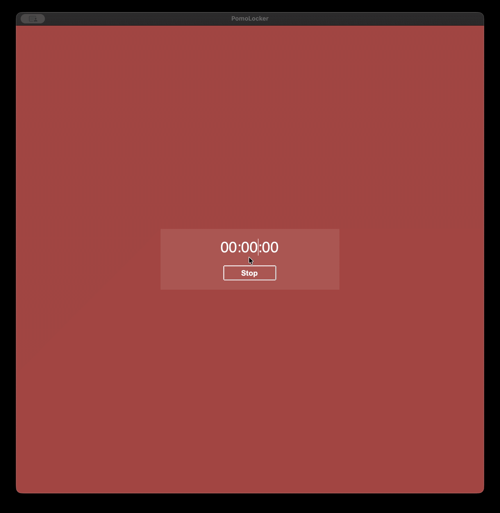

<h1>PomoLocker</h1>


<h2>Description</h2>
This is a project I created because I could not find a Pomodoro app that would lock my screen automatically once the timer's up, so here it
is! <br />
This app is not published anywhere because I did not want to deal with apple's review process (I think they would not approve this app since
it locks the screen automatically) and also because I did not want to pay for
an Apple developer account. But if you are willing to go through all of this stuff, feel free to publish it, the only thing I would like to ask is to make
the app free! <br />
I use this app daily so I will probably keep it updated, but I can't promise anything.

<h2>Building the App</h2>
To build this app you must have Python installed, version 3.13.5 or later (I have tried older versions, and it did not work).

All you have to do is clone the repository and run the following commands: <br />
```
python3.13 -m venv .venv
source .venv/bin/activate
pip install -r requirements.txt
./build.sh
```
`build.sh` detects the OS it is running on and produces a `.app` bundle on macOS and a single-file executable on Linux and
Windows, both in the `dist` folder.
```

<h2>Compatibility</h2>
<ul>
  <li>MacOS Sequoia 15.6.1 or later</li>
  <li>Linux with GNOME, KDE or Hyprland (Hyprland needs <code>hyprlock</code> installed)</li>
  <li>Windows 10 or later</li>
</ul>

